<a href="https://github.com/solidjs/solid/actions/workflows/main-ci.yml"></a>
<a href="https://coveralls.io/github/solidjs/solid?branch=main"></a>

  
- [***Que es Solid***](#que-es-solid)
- [***Principios de solid***](#principios-de-solid)
- [***Ventajas de Solid***](#ventajas-de-solid)
- [***Desventajas de Solid:***](#desventajas-de-solid)
- [***Importancia:***](#importancia)


 ## ***Que es Solid***
 *SOLID es un conjunto de cinco principios de diseño de software orientado a objetos que se utilizan para crear estructuras de clases más robustas, mantenibles y flexibles. Estos principios fueron introducidos por **Robert C. Martin** (también conocido como “tío Bob”) y se han convertido en una guía fundamental para los desarrolladores.*

*Esto se refiere a que el codigo sea mas mantenible, es decir que sea muy facil aplicar cambios  y corregir errores, ademas  de facilitar la incorporacion de nuevas funcionalidades. es decir hacer el codigo mas legible y facil de entender.*

## ***Principios de solid***

  1. ***Principio de Responsabilidad Única (SRP - Single Responsibility Principle)***
      
  *Este principio indica que cada clase deberia tener una unica resposabilidad, que deberia encargarse de una sola parte del sistema, el objetivo es conseguir que nuestras clases hagan una sola cosa, de esta forma podemos asegurar que estos estan cumpliendo con su funcion de forma correcta*

**Por ejemplo**: podemos nombrar  el registro de un nuevo usuario en cualquier plataforma web.

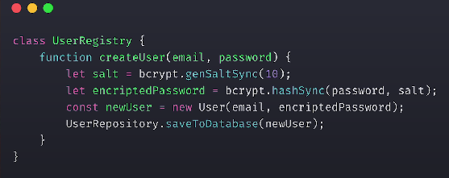


  
*Tenemos una clase que crea un nuevo usuario, la logica de encriptado de su contraseña, pero si lo hicieramos asi le estamos dando dos responsabilidades a esta clase:*

 * La primera:La resposabilidad es crear el propio objeto del usuario con la informacion necesaria que define la clase.
 * La segunda: Decicir como encriptar su contraseña.

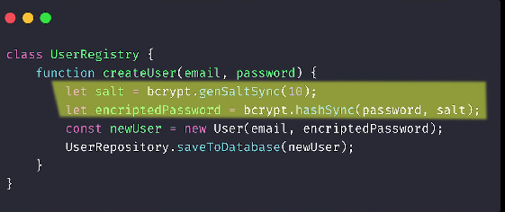


 *Por lo tanto estariamos rompiendo el primer principio de solid, debemos modificar este codigo tanto para añadir atributos a la clase usuario como en la  de contraseña.*

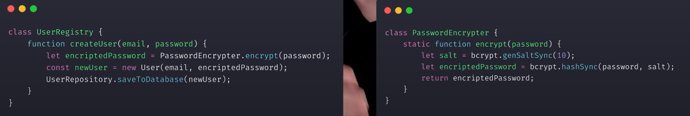

*La forma correcta de hacerlo segun SRP, seria mover todo el codigo de encriptado de contraseña  a su propia clase, para que de esta forma el comportamiento de encriptado quedaria encapsulado, de esemodo cada clase tiene su propia responsabilidad, es decir la clase que crea al usuario delega a la clase de encrpitado las resposabilidades que ella no puede asumir.*

2.   ***Principio Abierto-Cerrado (Open/Closed Principle - OCP):***
   
 *Las entidades de software (clases, módulos, funciones) deben estar abiertas para extensión pero cerradas para modificación.*
*Deberíamos poder agregar nuevas funcionalidades sin alterar el código existente.Basicamente lo que tratamos de conseguir con este principio es que la  funcionamidad badica y de  sistema este protegida, que no se pueda romper y para consegir ello. lo que deberiamos hacer es que  para añadir funcionalidades tenemosque escribir nuevo codigo y no asi modificar el codigo ta existente que seguramente ya funciona.*
*Es decir tenemos que tratar de escribir codigo que no  se tenga que cambiar cada vez que tenemos que modificar los requerimientos. perro conseguir esto no es facil, tenemos muchas herramientas para esto, pero las mas  optimas  son la herencia y el polimorfismo.*

 *vamos a verlo muy claro con un  **Ejemplo:***
  *imaginemos que tenemos una clase que define rectagulos tiene las propiedades de altura y anchura.*
   
   ```typescript

   class Rectangle {
  private width: number;
  private height: number;
   }
  ```
  *Tenemos una clase que se encarga de calcular el area total de estos rectangulos*

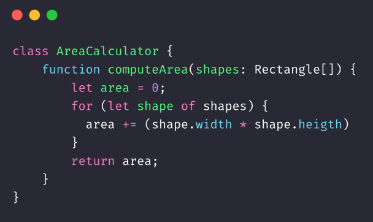


  *por lo tanto hace la multiplicacion  de la anchura por la altura. Esto si elrequerimiento es area de un rectangulos funciona perfectamente. pero que pasa si queremos que tambien calcule areas de triangulos.*
  *la formula de area de traingulos es diferente, por lo tanto tenemos que modificar nuestra clase para tener en cuenta la nueva posible formula*
   
   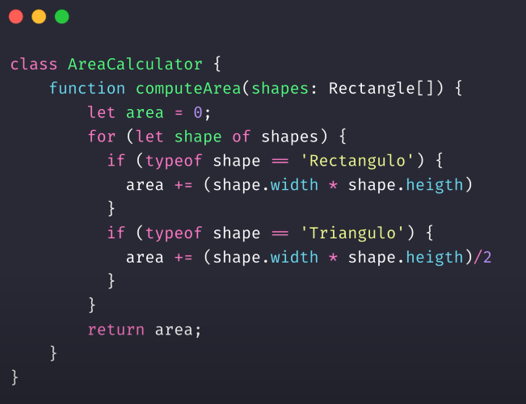

  *y esto nos pasara cada vez que querramos añadir nuevas funcionalidades, pero nuestra clase esta abierta para su modificacion por lo que hay peligro de incorporar bugs cada vez que queremos añadir nueva funcionalidad. la forma correcta de hacerlo seria utilizar polimorfismo.*

  *o en este caso crear un clase base forma o Ishape que tenga la funcion de calcular areas, la clase que calcula el area solo tiene que preguntar a la forma que harea tiene el objeto. nisiquiera deberia saber si es un triangulo o  rectagungulo o un circulo, con este diseño para añadir muevas formas basta con crear  nuevas clases  que hereden de la clase base.*

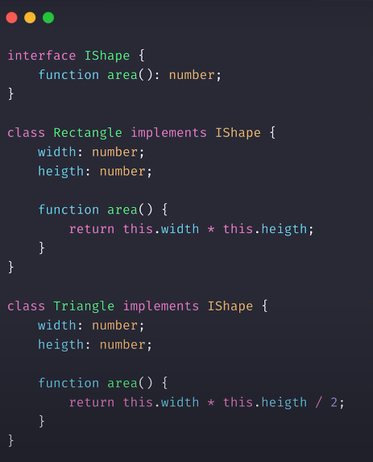            
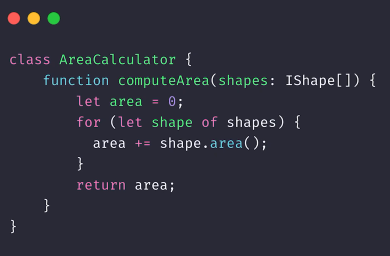


3.  ***Principio de Sustitución de Liskov (Liskov Substitution Principle - LSP):***
*Basicamente lo que nos dice este principio que toda clase que es hija de otra clase debe poder utilizarse como si fuera el mismo padre, nadie que necesite utilizar el padre tiene que comportarse diferente si interactua con cualquiera de sus decendientes.*

**El ejemplo** *que veremos a ver para este principio va a ser con patos.*

*Definimos que la clase pato tiene los metodos: nadar, volor y el metodo hacer cuack*

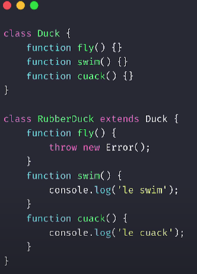

*Bien, ahora queremos representar un pato de goma, que nada hace cuack. pero no vuela. si por ejemplo devolvemos error cuando llamanos a volar.*

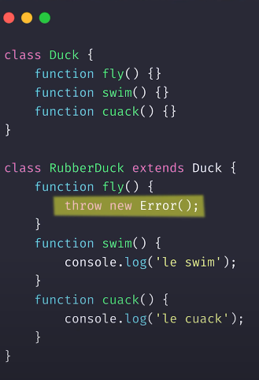

*Estamos violando el principio de sustitucion, ya que el programa se compotara diferente ante un pato de goma o ante un pato convenconal, por lo que tendremos  que añadir cierta logica ociertas comprobaciones solo por este caso concreto.*

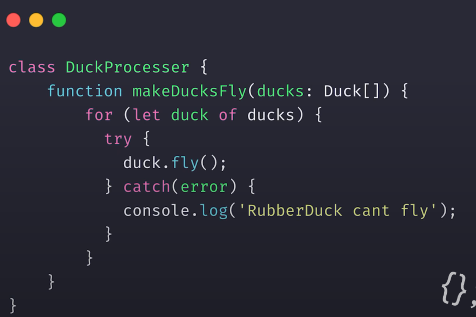

*Una posible solucion seria hacer que   volar  en pato de goma  sea una funcion vacia, una funcion que no hace nada, pero esto como puedes imaginar huele un poco mal.*

*La solucion es rediseñar el sistema con componentes individuales o inferfaces. De forma que ahora pato de goma,no hereda de pato.si no que implementa las intercafaces de nadar, hacer cuack. pero no la de volar.*

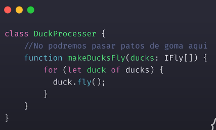

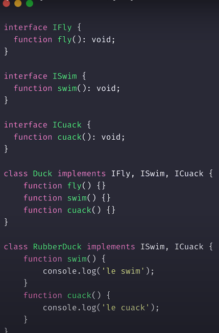

*Con  este cambio de diseño hemos definido mucho mejor, lo que es un pato de goma. y este es uno de los principales  puntos de encuentro que hay entre  la herencia y el diseño por componentes.*

4. ***Principio de Segregación de Interfaces (Interface Segregation Principle - ISP)***

 *Dice que los objetos no deberían verse forzados a depender de interfaces que no utilizan.*
*Cuando creamos interfaces para definir comportamientos, debemos asegurarnos de que los objetos que las implementan solo tengan que implementar los métodos que realmente necesitan. No deben estar obligados a implementar métodos irrelevantes para su funcionalidad.*

**Ejemplo:**

***Supongamos que estamos desarrollando un videojuego de simulación de animales. Inicialmente, tenemos tres clases de animales: Lion (león), Dog (perro) y Cat (gato). Cada uno de estos animales puede correr y hablar. Por lo tanto, creamos una interfaz llamada Animal con los métodos run() y speak():***

```Swift
protocol Animal {
    func run()
    func speak()
}

class Lion: Animal {
    func run() {
        print("🦁 corriendo")
    }
    func speak() {
        print("Roarrrr 🦁")
    }
}

class Dog: Animal {
    func run() {
        print("🐶 corriendo")
    }
    func speak() {
        print("Guau! 🐶")
    }
}

class Cat: Animal {
    func run() {
        print("😺 corriendo")
    }
    func speak() {
        print("Miau 😺")
    }
}
```
*Hasta aquí todo bien. Sin embargo, luego decidimos agregar peces al juego. Los peces no pueden correr ni hablar, pero pueden nadar. Si seguimos la interfaz original, tendríamos que implementar los métodos run() y speak() incluso para los peces, aunque no los necesiten. Esto violaría el ISP.*

Para resolverlo, aplicamos el ISP creando una nueva interfaz llamada SwimmingAnimal que solo contiene el método swim():

```Swift
protocol SwimmingAnimal {
    func swim()
}

class Salmon: SwimmingAnimal {
    func swim() {
        print("Nadando... 🐟")
    }
}
```
***Ahora los peces pueden implementar solo el método relevante (swim()) sin verse forzados a implementar los métodos innecesarios (run() y speak()). Así cumplimos con el Principio de Segregación de Interfaces12.***

Recuerda que este es solo un ejemplo ilustrativo, pero espero que te ayude a entender cómo aplicar el ISP en tus propios diseños de clases. 😊

5. ***Principio de Inversión de Dependencia (Dependency Inversion Principle - DIP):***

*Este principio sugiere que las clases de alto nivel no deben depender directamente de las clases de bajo nivel. En cambio, ambas deben depender de abstracciones (interfaces o clases base).*
*La inversión de dependencia permite una mayor flexibilidad y facilita la sustitución de componentes sin afectar el funcionamiento del sistema*


**Ejemplo práctico:**
*Imagina que estamos desarrollando una aplicación de comercio electrónico. Tenemos una clase PaymentProcessor que maneja los pagos. Originalmente, depende directamente de una clase CreditCardPayment.*
*Aplicando el DIP, creamos una interfaz llamada IPaymentMethod con métodos como processPayment() y refund(). Luego, CreditCardPayment implementa esta interfaz.*
*Ahora, PaymentProcessor depende de IPaymentMethod, no de la implementación concreta. Si más adelante agregamos otros métodos de pago (por ejemplo, PayPal), simplemente creamos una nueva clase que implemente IPaymentMethod sin afectar PaymentProcessor.*
*En resumen, el DIP nos ayuda a crear sistemas más flexibles y fáciles de mantener al invertir las dependencias entre módulos. ¡Espero que este ejemplo te ayude a comprender mejor este principio! 😊*

 ## ***Ventajas de Solid*** 

* Cohesión y Acoplamiento:
  *  Cohesión: Los principios SOLID promueven la cohesión al enfocarse en una sola responsabilidad por clase. Esto facilita la comprensión y el mantenimiento del código.
  * Acoplamiento: Al seguir estos principios, se reduce el acoplamiento entre clases, lo que permite cambios más sencillos sin afectar otras partes del sistema.
  
* Reutilización de Código:
    * Los principios SOLID fomentan la creación de clases más pequeñas y específicas. Esto facilita la reutilización de componentes en diferentes contextos y proyectos.
* Testeabilidad:
    * Al separar las responsabilidades y depender de interfaces o abstracciones, se simplifica la escritura de pruebas unitarias e integración.
* Escalabilidad:
     * Siguiendo estos principios, el código es más escalable y adaptable a cambios futuros. Se pueden agregar nuevas funcionalidades sin afectar el código existente.
 
 ## ***Desventajas de Solid:***

 * ***Complejidad:***
      * *Al aplicar los principios SOLID, es posible que se creen más interfaces o clases pequeñas. Esto podría aumentar la complejidad del sistema.*
    * *Es importante encontrar un equilibrio entre seguir los principios y mantener la simplicidad del diseño.*
  
  ## ***Importancia:***

  *Las buenas prácticas en el desarrollo de software son esenciales para garantizar la calidad, la eficiencia y la sostenibilidad de los proyectos. A continuación, te presento algunas razones por las que las buenas prácticas son importantes:*

  1.  ***Mantenibilidad:***
      *  Las buenas prácticas facilitan la lectura, comprensión y modificación del código.
      *  Un código bien estructurado es más fácil de mantener y corregir en el futuro.
  2. ***Colaboración:***
       * Siguiendo buenas prácticas, los equipos de desarrollo pueden trabajar de manera más eficiente y colaborativa.
        * El código coherente y bien organizado permite una mejor comunicación entre los miembros del equipo.
  3. ***Eficiencia:***
       * Las buenas prácticas ayudan a evitar redundancias y ineficiencias en el código.
       * Se promueve la reutilización de componentes, lo que ahorra tiempo y recursos.
 1. ***Seguridad:***
      *  Las buenas prácticas incluyen aspectos como la validación de datos, la seguridad de contraseñas y la protección contra ataques.
   *  Siguiendo estas prácticas, se reduce el riesgo de vulnerabilidades y brechas de seguridad.
  2. ***Escalabilidad:***
   *  Un código bien diseñado es más fácil de ampliar y adaptar a medida que crece el proyecto.
   *  Las buenas prácticas permiten agregar nuevas funcionalidades sin afectar el funcionamiento existente.
  3. ***Calidad del Producto Final:***
      *  Las buenas prácticas contribuyen a un producto final de alta calidad.
      *  Los usuarios se benefician de aplicaciones más estables, rápidas y confiables.

<h3 id="sponsors">Sponsors</h3>

  

  


